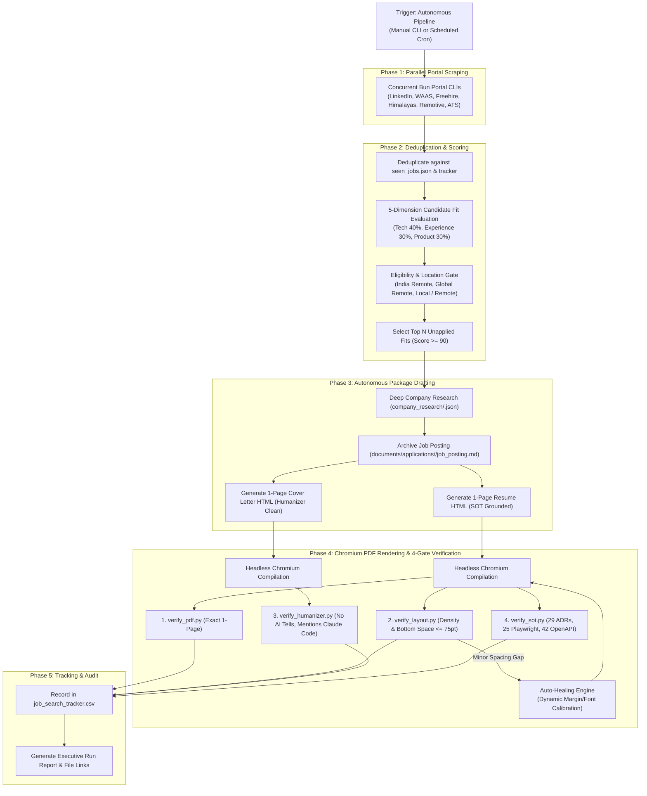

# End-to-End Autonomous Job Application Pipeline Guide

This document describes the fully automated recruitment engine built for **Alex Doe** in `ai-job-search-global`.

---

## 1. Pipeline Architecture



---

## 2. CLI Usage & Commands

The unified autonomous engine is implemented in [`tools/autonomous_job_pipeline.py`](tools/autonomous_job_pipeline.py).

### A. Full End-to-End Pipeline (Scrape $\to$ Rank $\to$ Tailor $\to$ Compile $\to$ Verify $\to$ Record)

```bash
# Scrape all portals, pick top 5 global remote fits, and generate verified packages:
python3 tools/autonomous_job_pipeline.py --mode full --target global-remote --top 5

# Target India-wide remote and Local / Remote local hybrid:
python3 tools/autonomous_job_pipeline.py --mode full --target india-remote --top 5

# Target all remote & regional opportunities:
python3 tools/autonomous_job_pipeline.py --mode full --target all --top 5
```

### B. Fast Batch Drafting on Cached / Scraped Postings

```bash
# Draft packages for the top 5 highest-scoring unapplied jobs without re-scraping:
python3 tools/autonomous_job_pipeline.py --mode apply-batch --no-scrape --top 5
```

### C. Portal Scraping Only

```bash
# Run broad scrape across all 6 portal CLIs and update seen_jobs.json:
python3 tools/autonomous_job_pipeline.py --mode scrape-only --days 14
```

### D. Fit Ranking & Shortlisting Only

```bash
# View JSON output of top 10 unapplied candidates sorted by fit score:
python3 tools/autonomous_job_pipeline.py --mode rank-only --top 10
```

---

## 3. Unattended Scheduling (Cron & Antigravity Native)

### Option 1: Native Antigravity Schedule (Recommended)
You can trigger recurring background runs directly inside Antigravity by using the `/schedule` command:

```text
/schedule cron="0 9 * * 1-5" prompt="Run autonomous job search pipeline: python3 tools/autonomous_job_pipeline.py --mode full --target global-remote --top 3"
```

### Option 2: Linux User Crontab
To run every weekday at 9:00 AM UTC:

```bash
0 9 * * 1-5 cd this repository && /usr/bin/python3 tools/autonomous_job_pipeline.py --mode full --target global-remote --top 3 >> cron.log 2>&1
```

---

## 4. Strict Quality & Grounding Directives

Every package produced by the automated pipeline strictly satisfies all four verification criteria:
1. **1-Page Physical Geometry:** Single page with balanced density (bottom whitespace $\le 75\text{pt}$ / $\approx 9.5\%$).
2. **Humanizer & Tone Rules:** Zero banned AI words (*leverage*, *spearhead*, *align with*), zero em dashes in body prose, and natural conversational cadence.
3. **Grounding SOT (Career Source of Truth):**
   - **Project Nexus:** 29 ADRs, 25 Playwright test suites, 16 modules.
   - **Acme Corp:** 8 core HRMS modules, 42 OpenAPI endpoints, 10,000+ active enterprise users, 28 Indian states statutory compliance.
   - **Status & Notice:** 45-day notice period, NO US work authorization claim.
4. **Master Template Conformity:** Uses locked HTML/CSS structure from `cv/Resume_Master.html` and `cover_letters/Cover_Letter_Master.html`.
