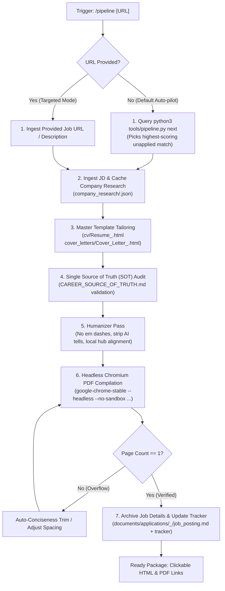

# Autonomous Application Pipeline Guide (`/pipeline`)

This guide documents the autonomous end-to-end job application pipeline built for the **Google Antigravity (AGY)** agentic runtime in `ai-job-search-global`.

The `/pipeline` skill automates what previously required multiple interactive rounds (`/scrape` $\to$ `/rank` $\to$ candidate review $\to$ `/apply` $\to$ reviewer agent $\to$ humanizer $\to$ PDF compilation $\to$ tracker logging) into a **single command**.

---

## 1. Architecture & Workflow



---

## 2. Invocation & Usage

### A. Autonomous Auto-Pilot Mode (Recommended)
Pulls the highest-scoring unapplied posting from `job_scraper/seen_jobs.json` that passes location and language gates, builds the complete package, and updates the tracker:

```bash
/pipeline
```

### B. Targeted Job URL Mode
Directs the full pipeline onto a specific job posting:

```bash
/pipeline https://in.linkedin.com/jobs/view/4438076952
```

### C. Scheduled Background Automation
Using Antigravity's native `/schedule` command, the pipeline can run automatically on a recurring schedule (e.g. every weekday at 9:00 AM) to prepare draft applications in the background:

```
/schedule cron="0 9 * * 1-5" prompt="Run /pipeline to draft an application for the top unapplied match"
```

---

## 3. CLI Helper Reference (`tools/pipeline.py`)

The pipeline relies on `tools/pipeline.py` for deterministic operations:

| Subcommand | Usage | Purpose |
|---|---|---|
| `next` | `python3 tools/pipeline.py next` | Returns JSON for the top unapplied candidate with `location_verdict == PASS` not present in the tracker. |
| `compile` | `python3 tools/pipeline.py compile --html <path> --pdf <path>` | Runs headless Chromium, verifies strict 1-page bounds via `tools/verify_pdf.py`, and checks balanced fill density via `tools/verify_layout.py`. |
| `record` | `python3 tools/pipeline.py record --company ... --role ...` | Formats and appends the application row into `job_search_tracker.csv`. |
| `archive` | `python3 tools/pipeline.py archive --company ... --role ...` | Formats and saves the job posting and metadata into `documents/applications/<company>_<role>/job_posting.md`. |

---

## 4. Mandatory Directives & Non-Negotiables

### A. Grounding Single Source of Truth (FACTS)
All factual claims, numbers, and dates must strictly trace to [`CAREER_SOURCE_OF_TRUTH.md`](file://CAREER_SOURCE_OF_TRUTH.md).

- **Project Nexus Metrics:**
  - **29 ADRs** (never 30 — superseded).
  - **25 Playwright test suites** (never 14 — superseded).
  - **16 feature modules**.
  - **TTI 2.1s to 120ms** calendar virtualization.
- **Acme Corp Scope & Platform:**
  - **8 core HRMS modules** owned.
  - **4 modules / 42 OpenAPI endpoints**, **10,000+ active enterprise users** (MyPay scope).
  - **28 Indian states** statutory compliance.
- **Excluded Claims (Strictly Prohibited):**
  - **ZERO Jira ticket counts or QN keys** on CVs or cover letters.
  - **NEVER claim US work authorization** (requires visa sponsorship).
  - **Notice period is 45 days**.

### B. Locked Master Document Design System
Both documents must preserve the visual system established in the master reference files:

1. **Resume Template:** [`cv/Resume_Master.html`](cv/Resume_Master.html)
   - Font family: `-apple-system, BlinkMacSystemFont, 'Segoe UI', Roboto, 'Helvetica Neue', Arial, sans-serif`
   - Margins: `@page { margin: 0.34in 0.42in; size: letter; }`
   - Header: Centered uppercase name with `2px solid #111` bottom border.
   - Bullet style: `–` (en-dash) with `margin-bottom: 2px`.
   - Keyword emphasis: In-line `<strong>` tags in `#0f172a`, font-weight 600.
   - **Page limit: Strictly exactly 1 page.**

2. **Cover Letter Template:** [`cover_letters/Cover_Letter_Master.html`](cover_letters/Cover_Letter_Master.html)
   - Same typography and centered header branding.
   - Addressed to the company hiring team.
   - Value-add bullet points using en-dash `–` styling.
   - AI tooling reference: Mention **Claude Code** by name.
   - **Page limit: Strictly exactly 1 page.**

### C. Mandatory Final Humanizer Gate Across Everything
Before compiling or presenting to the user, EVERY piece of text (Resume bullets, Cover Letter prose, summaries, screening answers, and outreach blurbs) undergoes the strict humanizer audit against `.agents/skills/humanizer/SKILL.md`:
- **No em dashes in prose:** Replace all em dashes (`—`) and prose en dashes (`–`) with commas, periods, colons, or clean sentence restructures. (The en-dash `–` bullet marker in HTML list tags is the only permitted usage).
- **Remove AI stock vocabulary:** Never use "leverage", "align with", "delve", "testament", "spearheaded", "pivotal", "game-changer", "cutting-edge", or staged transitions ("Here is how my background...", "Let's dive in").
- **Tone:** Direct, confident, first-person active voice in cover letters; ego-dropped, action-verb-led in resume bullets. No defensive hedging, apologetic phrases, or chatbot residue ("I hope this helps").
- **Location Calibration:** Note San Francisco / Local / Remote locality or remote readiness clearly.
- **Strict SOT Grounding:** Every claim traces directly to `CAREER_SOURCE_OF_TRUTH.md`.

---

## 5. Output Filename & Directory Convention

Every application package is stored systematically:

| Artifact | Location Pattern | Example |
|---|---|---|
| **Resume Source** | `cv/Resume_<Company>.html` | `cv/Resume_Altudo.html` |
| **Resume PDF** | `cv/Resume_<Company>.pdf` | `cv/Resume_Altudo.pdf` |
| **Cover Letter Source** | `cover_letters/Cover_Letter_<Company>.html` | `cover_letters/Cover_Letter_Altudo.html` |
| **Cover Letter PDF** | `cover_letters/Cover_Letter_<Company>.pdf` | `cover_letters/Cover_Letter_Altudo.pdf` |
| **Company Research** | `company_research/<company>.json` | `company_research/altudo.json` |
| **Job Posting Archive** | `documents/applications/<company>_<role>/job_posting.md` | `documents/applications/altudo_senior_next_js_developer/job_posting.md` |

*`<Company>` must be filesystem-safe: spaces converted to underscores, punctuation removed.*

---

## 6. 5-Gate Verification Toolchain

The headless Chromium PDF pipeline executes the complete 5-gate test suite on every compile:
- **Binary:** Chromium / Google Chrome Stable at `google-chrome-stable`.
- **Runtime Flags:** `--headless --no-sandbox --disable-gpu --no-pdf-header-footer --print-to-pdf=<output.pdf> <input.html>`.
  *(Note: `--no-sandbox` is required on hardened Linux hosts/VPS with unprivileged user namespace restrictions).*
- **Gate 1 (`tools/verify_pdf.py`):** Extracts text layer via `pdftotext` (poppler-utils) / `pypdf` and asserts `pages == 1`.
- **Gate 2 (`tools/verify_layout.py`):** Measures exact word bounding boxes to verify balanced margins (little space top ~0.36in, little space bottom ~0.36-0.6in, max bottom whitespace ≤ 75pt / ~9.5%), preventing underfilled half-empty pages.
- **Gate 3 (`tools/verify_template.py`):** Asserts 100% exact Master markup hierarchy, DOM classes (`div.header`, `div.section`, `div.entry`, etc.), CSS typography rules, and print margins (`0.36in 0.44in`).
- **Gate 4 (`tools/verify_humanizer.py`):** Scans for prose em dashes (`—`), banned AI stock vocabulary ("leverage", "spearheaded", "pivotal"), and robotic transitions.
- **Gate 5 (`tools/verify_sot.py`):** Ensures all metrics and dates strictly match `CAREER_SOURCE_OF_TRUTH.md`.
- **Skill Linting:** Ensure all skills comply with YAML standards:
  ```bash
  python3 tools/lint_skills.py
  ```

---

## 7. Example Output Shape (Reference)

`python3 tools/pipeline.py compile --html <source.html> --pdf <output.pdf>` produces one
ATS-safe 1-page PDF per document, plus the archived posting and tracker row:

- Resume: `cv/Resume_<Company>.pdf` (source: `cv/Resume_<Company>.html`)
- Cover Letter: `cover_letters/Cover_Letter_<Company>.pdf` (source HTML alongside it)
- Job archive: `documents/applications/<company>_<role>/job_posting.md`
- Tracker row: `job_search_tracker.csv` (status `drafted`, then `applied`)
